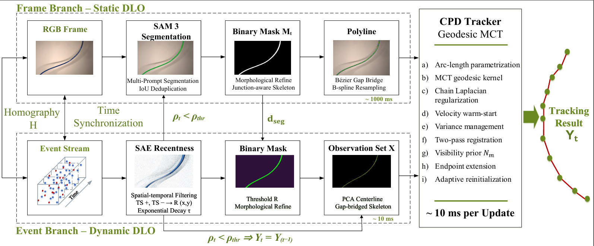
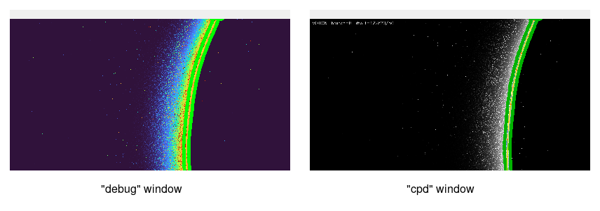

# MotionDLO: Hybrid Event- and Frame-Based Tracking of Deformable Linear Objects.

> **Anonymous Authors**

<p align="center">
  
</p>

MotionDLO tracks the centerline of a DLO at event rate (~10 ms) by fusing a
SAM 3 frame branch with an adapted Coherent Point Drift (CPD)-based event branch. Branch selection is driven
by a hysteretic motion-state detector that monitors the count of events
falling on the current cable mask: the event branch updates the tracker
during manipulation, while SAM 3 fires once on each return to a static state
to correct accumulated drift.

---

## Requirements

Tested on Ubuntu 24.04 with an NVIDIA RTX 6000 Ada (49 GB VRAM), driver
580.126.09 / CUDA 13.0, and Python 3.10. Other CUDA-compatible NVIDIA GPUs
likely work — torch's CUDA 12.8 wheel is forward-compatible with newer
drivers — but only the above has been validated.

### Python packages

All pip-installable dependencies are pinned in [`requirements.txt`](requirements.txt).
Install them into the environment created in [Installation](#installation) — not
into your base environment.

### Vendor SDKs

These are **not** on PyPI, and each needs a step beyond
`pip install -r requirements.txt` to become importable from your environment.

- **[Prophesee Metavision SDK](https://docs.prophesee.ai/stable/installation/)** —
  required for every mode. Installs system-wide via apt (`metavision-sdk`,
  `metavision-sdk-python3.10`), placing `metavision_core`, `metavision_hal` and
  `metavision_sdk_*` in the **system** interpreter's `dist-packages`
  (`/usr/lib/python3/dist-packages`), not in your environment. A conda env or
  venv is isolated from that path, so it must be bridged in — see step 3 below.
  The apt packages target system Python 3.9 and 3.10 only, which is why the
  environment has to be Python 3.10.

- **[Meta SAM 3](https://github.com/facebookresearch/sam3)** — required for the
  frame branch (`hybrid` and `frame-only`). Clone it and install editable into
  this environment.

- **[IDS Peak SDK](https://en.ids-imaging.com/ids-peak.html)** — required
  **only** for `recording/synchronised_recorder.py`, not for running the
  tracker on recorded data. It installs to `~/.local/lib/python3.10/site-packages`,
  which is on `sys.path` by default, so it needs no bridge.

---

## Installation

1. Install the Metavision SDK system-wide, following Prophesee's instructions.
   Confirm it imports under the system interpreter — use the full path, since
   `python3` may already point at a conda environment:

   ```bash
   /usr/bin/python3 -c "import metavision_core; print(metavision_core.__file__)"
   ```

2. Create a Python 3.10 environment:

   ```bash
   conda create -n motiondlo python=3.10 pip -y
   conda activate motiondlo
   ```

3. Bridge the SDK into the environment. Without this the tracker fails at
   import with `ModuleNotFoundError: No module named 'metavision_core'`:

   ```bash
   echo /usr/lib/python3/dist-packages > \
     "$(python -c 'import site; print(site.getsitepackages()[0])')/metavision.pth"

   python -c "from metavision_core.event_io import EventsIterator; print('ok')"
   ```

4. Install the pip dependencies and the code:

   ```bash
   git clone https://github.com/RobotDLO/MotionDLO.git
   cd MotionDLO
   pip install -r requirements.txt
   ```

5. Install SAM 3 into the same environment:

   ```bash
   git clone https://github.com/facebookresearch/sam3 /path/to/sam3
   pip install -e /path/to/sam3
   ```

   The checkpoint is **not** bundled: SAM 3 downloads it from Hugging Face on
   first use. That repository is gated, so you need a Hugging Face account with
   access granted to the SAM 3 model, and a token available locally:

   ```bash
   huggingface-cli login       # or export HF_TOKEN=...
   ```

   Without this, `hybrid` and `frame-only` start normally and fail later, when
   the first SAM 3 correction fires.

6. Only if you plan to record your own data, install the IDS Peak SDK.

Verify the environment before running anything:

```bash
python -c "import metavision_core, sam3, torch; print(torch.cuda.is_available())"
```

---

## Quickstart

Run the tracker on the bundled sample sequence — no camera hardware required.

1. A ready-to-run sample (DLO 2 (green cable), manipulation speed 100) ships in
   [`data/Green/Speed_100/`](data/Green/Speed_100), with this layout
   (see [Input data format](#input-data-format)):

   ```text
   data/Green/Speed_100/
   ├── events.raw   
   ├── frames/               
   │   ├── frame_000001.jpg
   │   └── ...
   └── manifest.json      
   ```

2. Run the hybrid tracker from the repository root, passing every path
   explicitly (the paths below are relative to that root):

   ```bash
   python src/motiondlo_pipeline.py \
       --mode       hybrid \
       --input-path data/Green/Speed_100/events.raw \
       --frames-dir data/Green/Speed_100/frames \
       --manifest   data/Green/Speed_100/manifest.json \
       --homography homography/rgb_to_event_H.npy \
       --use-ridge-mask \
       --show
   ```
   `--use-ridge-mask` selects the ridge-based mask extractor, which is the
   recommended setting — see
   [Adapting the filters to different DLO types](#adapting-the-filters-to-different-dlo-types).

> Supply `--input-path`, `--frames-dir`,`--manifest`, and `--homography` as flags each run (as shown above), 
> or set them once via the `default=` values in `src/config.py` and run with no flags.

A shipped homography (`homography/rgb_to_event_H.npy`) is included for the
recording; recalibrate for a different setup.

### Expected result

`--show` opens two OpenCV windows: `debug` (recentness heatmap with the wire
mask in green) and `cpd` (the live tracked centerline).

<p align="center">
  
</p>

---

## Usage

### Offline (recorded `.raw` + frames)

```bash
python src/motiondlo_pipeline.py \
    --mode hybrid \
    --input-path /path/to/events.raw \
    --frames-dir /path/to/frames \
    --manifest   /path/to/manifest.json \
    --homography /path/to/rgb_to_event_H.npy \
    --use-ridge-mask \
    --show
```

### Modes

| `--mode`     | Behaviour                                              |
|--------------|--------------------------------------------------------|
| `hybrid`     | state machine (default)                                |
| `event-only` | Event branch only                                      |
| `frame-only` | SAM 3 baseline at fixed cadence                        |

See [`src/config.py`](src/config.py) for the full parameter list.

### Adapting the filters to different DLO types

Two flags cover most of the difference between cables. Add them to the command
shown above (keep the four path flags):

| Flag | What it does | When to use it |
|------|--------------|----------------|
| `--use-ridge-mask` | Extracts the cable with a multi-scale ridge filter instead of the default Otsu threshold + morphology. | Recommended in general, and especially for cables that are thinner or thicker than the sample — the ridge scales are derived from the cable diameter. |
| `--disable-stc` | Turns off the Spatio-Temporal Contrast event filter. | For cables that trigger few events — low contrast against the background, or a dark or matte surface — where STC discards wire events along with the noise. |

Default, and the setting used for the shipped sample:

```bash
python src/motiondlo_pipeline.py <paths as above> --use-ridge-mask --show
```

Low-event-yield cables:

```bash
python src/motiondlo_pipeline.py <paths as above> --use-ridge-mask --disable-stc --show
```

### Outputs

Written to the current directory:

- `tracker_polylines.npz` — per-update tracker state, branch label, timestamps
- `sam3_polylines.npz`    — every applied SAM 3 correction
- `timing.csv`            — per-stage timings matching 

---

## Input data format

| File | Format | Notes |
|------|--------|-------|
| `events.raw`    | Prophesee RAW | event stream from the EVK4 / Metavision camera |
| `frames/`       | `.jpg` images | RGB frames |
| `manifest.json` | JSON object   | maps each frame filename to its trigger timestamp in the **event camera's µs clock**:  |
| `homography`    | `.npy` (3×3)  | RGB→event homography H; one is shipped in [`homography/rgb_to_event_H.npy`](homography/rgb_to_event_H.npy) |

The recorder (below) produces `events.raw`, `frames/`, and `manifest.json`
together so the timestamps stay consistent.

---

## Data acquisition

Synchronised recording (IDS Peak frame + Prophesee event, hardware-triggered):

```bash
python recording/synchronised_recorder.py --duration 30
```

Produces `events.raw`, `frames/*.jpg`, and a `manifest.json` mapping each
frame to its trigger timestamp in the event camera's µs clock.

---

## Dataset

Benchmark recordings (three DLO types × three manipulation speeds, with
hardware-synchronized event and frame streams) are available in the
[Dataset](https://figshare.com/s/c1af51646394fc36f150)

---

## Notes / Troubleshooting

- **Frames and events must be hardware-synchronised.** The tracker matches each
  SAM 3 frame to an event timestamp via `manifest.json`; mismatched clocks
  produce drifting corrections.
- **SAM 3 needs a GPU.** CPU execution works but is far too slow for the
  ~10 ms event-rate target. Peak GPU memory observed running the bundled
  sample (`hybrid` mode) was ~4.8 GB; actual usage scales with input image
  resolution, so budget more for larger frames.
- **`No such file or directory` on startup** usually means you relied on the
  `config.py` defaults — pass `--input-path`, `--frames-dir`, `--manifest`,
  and `--homography` explicitly.
- **`ModuleNotFoundError: No module named 'metavision_core'`** means the Python
  you launched cannot see the Metavision SDK. The SDK is installed by apt into
  the system interpreter (`/usr/lib/python3/dist-packages`), not by pip, so a
  fresh conda env or venv will not find it. Either create the environment with
  access to system packages (`python -m venv --system-site-packages …`), or add
  the SDK to an existing env:

  ```bash
  echo /usr/lib/python3/dist-packages > "$(python -c 'import site; print(site.getsitepackages()[0])')/metavision.pth"
  ```

  The env's Python must be the same minor version as the system one (3.10), as
  the SDK ships compiled extensions. Verify with
  `python -c "import metavision_core; print(metavision_core.__file__)"`.
- **The run starts, then fails when SAM 3 first loads.** The SAM 3 checkpoint is
  downloaded from a gated Hugging Face repository, so it needs an account with
  access to the model plus a local token (`huggingface-cli login`, or `HF_TOKEN`).
  `event-only` mode does not touch SAM 3 and runs without it.
- **`--show` opens an OpenCV window** and will fail over SSH or on a headless
  machine. Drop the flag to run without a display; the output files are written
  either way.

---

## Citation

```bibtex
@misc{hartmann2026motiondlohybrideventframebased,
      title={MotionDLO: Hybrid Event- and Frame-Based Tracking of Deformable Linear Objects}, 
      author={Annalena Hartmann and Priyamvada Ajithkumar and Patrick Bründl and Jörg Franke},
      year={2026},
      eprint={2608.22398},
      archivePrefix={arXiv},
      primaryClass={cs.RO},
      url={https://arxiv.org/abs/2608.22398}, 
}
```

## Acknowledgements

Project acknowledgements have been withheld to preserve author anonymity and will be included in the final manuscript if the paper is accepted.

## License

MIT — see [`LICENSE`](LICENSE).
